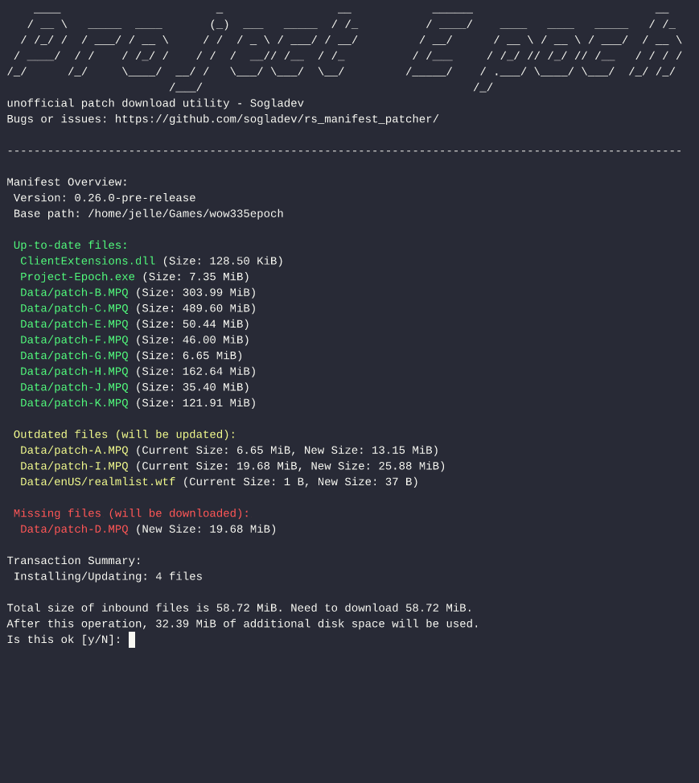

# Rs Manifest Patcher

A Rust terminal patcher that uses a manifest to manage file updates. It displays a transaction overview, provides detailed progress, and only overwrites files listed in the manifest. It does not remove extra files. Designed for easy extension with minimal dependencies.

Rust-port of [go-manifest-patcher](https://github.com/sogladev/go-manifest-patcher)

For more verbose docs see https://github.com/sogladev/go-manifest-patcher

Feature comparison with [go-manifest-patcher](https://github.com/sogladev/go-manifest-patcher).
- Terminal colors for Windows are supported.
- Extra file checking for local files not in the manifest is not implemented.



## Test/develop with Test Server for Go Manifest Patcher
https://github.com/sogladev/go-manifest-patcher/tree/main/server
> This is a test server application designed to simulate file downloads for the patcher download client. It provides manifest generation and throttled file serving capabilities.

## Build

To build this project, you need to have Rust installed. You can download it from the [official Rust website](https://www.rust-lang.org/). If you are new to Rust, you can learn more from the [Rust Book](https://doc.rust-lang.org/book/).

### Build for Linux
```sh
cargo build --release --locked
```

### Build for Windows

```sh
cargo build --target x86_64-pc-windows-gnu --release --locked
```
